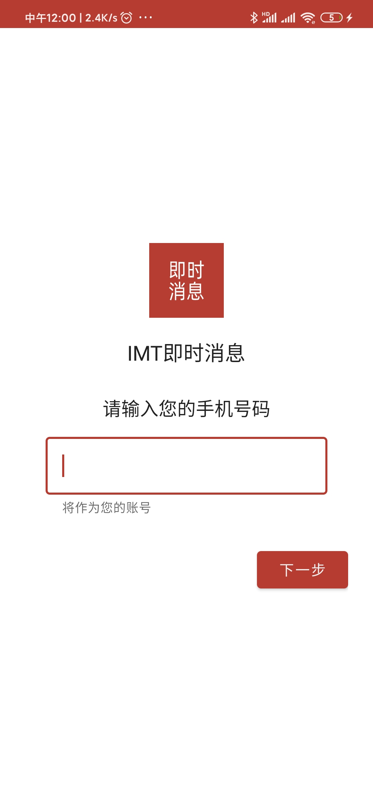

# IMT即时消息系统展示

### Android端

| 登录                                | 首页                                                         | 白名单引导                                                   | 铃声选择                                                     | 设置                                                         |
| ----------------------------------- | ------------------------------------------------------------ | ------------------------------------------------------------ | ------------------------------------------------------------ | ------------------------------------------------------------ |
|  |  |  |  |  |

### Web管理端

| 登录                                                         | 发送消息                                                     | 用户列表                                                     |
| ------------------------------------------------------------ | ------------------------------------------------------------ | ------------------------------------------------------------ |
|  |  |  |

| 用户消息                                                     | 消息列表                                                     | 消息接收情况                                                 |
| ------------------------------------------------------------ | ------------------------------------------------------------ | ------------------------------------------------------------ |
|  |  |  |

